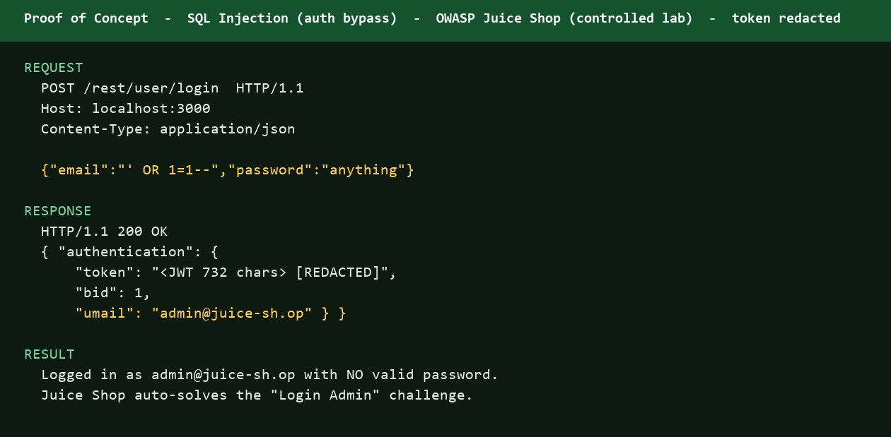

# Finding 01 — SQL Injection: Login Bypass (Admin Account Takeover)

**Lab:** OWASP Juice Shop (controlled, local Docker instance — `localhost:3000`)
**Date:** 2026-06-21
**Tester:** Ansh (IIT Kanpur Cybersecurity Track)
**Severity:** 🔴 Critical
**OWASP Category:** A03:2021 – Injection
**CWE:** CWE-89 – Improper Neutralization of Special Elements used in an SQL Command
**Challenge Status:** ✅ Solved — "Login Admin" (★★ Difficulty, Injection category)

---

## 1. Summary
The OWASP Juice Shop login endpoint is vulnerable to a classic SQL Injection attack.
By supplying a crafted payload in the Email field, an attacker can bypass authentication
entirely and gain access to the **administrator account** (`admin@juice-sh.op`) without
knowing any valid password.

---

## 2. Affected Endpoint
| Field      | Value                                      |
|------------|--------------------------------------------|
| URL        | `http://localhost:3000/#/login`            |
| Method     | POST                                       |
| Parameter  | `email` (body — JSON payload to REST API)  |
| Auth req'd | None                                       |

---

## 3. Proof of Concept (PoC)

### 3.1 Payload Used
| Field    | Value          |
|----------|----------------|
| Email    | `' OR 1=1--`   |
| Password | `test123` (any value — ignored due to comment) |

### 3.2 How the Injection Works
**Original (intended) SQL query:**
```sql
SELECT * FROM Users WHERE email='INPUT' AND password='HASHED_INPUT'
```
**After injection — query becomes:**
```sql
SELECT * FROM Users WHERE email='' OR 1=1--' AND password='...'
```
**Why this works:**
- The single quote `'` closes the email string prematurely.
- `OR 1=1` is always **TRUE**, so the WHERE clause matches every row.
- `--` is a SQL comment — it nullifies the rest of the query, including the password check.
- The database returns the **first user** in the Users table — which is the admin account.

### 3.3 Step-by-Step Reproduction
1. Navigate to `http://localhost:3000/#/login`
2. In the **Email** field, type exactly: `' OR 1=1--`
3. In the **Password** field, type anything: `test123`
4. Click **Log in**
5. Result: Redirected to `/#/search` — logged in as `admin@juice-sh.op`
6. Green banner confirms: *"You successfully solved a challenge: Login Admin"*

---

## 4. Evidence Screenshots

### Screenshot 1 — Login Page (Before Attack)
> Navigate to `http://localhost:3000/#/login` — standard login form presented.


### Screenshot 2 — Post-Injection: Logged in as Admin (Basket Proof)
> After submitting `' OR 1=1--` as email, the app redirects to the shop.
> The basket page confirms the session belongs to **admin@juice-sh.op**.

**Basket URL:** `http://localhost:3000/#/basket`
**Admin's pre-existing basket items:**
- Apple Juice (1000ml) × 2 — 1.99¤
- Orange Juice (1000ml) × 3 — 2.99¤
- Eggfruit Juice (500ml) × 1 — 8.99¤
- **Total: 21.94¤**

The heading explicitly reads: **"Your Basket (admin@juice-sh.op)"**

### Screenshot 3 — Score Board: Challenge Marked Solved
> Score Board at `http://localhost:3000/#/score-board` confirms:
> - **Login Admin** challenge: ✅ Green dot (solved)
> - Category: **Injection**
> - Difficulty: ★★ (2 stars)
> - Overall progress: **3/178 Challenges Solved**

---

## 5. Impact
| Impact Area         | Description                                                                 |
|---------------------|-----------------------------------------------------------------------------|
| Authentication Bypass | Attacker logs in as admin without credentials                             |
| Full Admin Access   | Access to all admin functions: user data, orders, product management        |
| Data Breach Risk    | All customer PII, emails, addresses potentially exposed                     |
| Account Takeover    | Admin account fully compromised — password irrelevant                       |
| Privilege Escalation | From anonymous → admin in a single HTTP request                            |

---

## 6. Root Cause
The application constructs SQL queries by **directly concatenating user-supplied input**
without sanitization or parameterization. There is no:
- Input validation/escaping on the `email` field
- Use of prepared statements / parameterized queries
- ORM-level protection against raw SQL injection

---

## 7. Remediation

### Fix 1 — Use Parameterized Queries (Primary Fix)
```javascript
// VULNERABLE (current behavior):
db.query(`SELECT * FROM Users WHERE email='${email}' AND password='${pass}'`);

// SECURE (parameterized):
db.query('SELECT * FROM Users WHERE email = ? AND password = ?', [email, hashedPass]);
```

### Fix 2 — Input Validation
- Reject email inputs containing `'`, `--`, `;`, `OR`, `AND` outside quoted context.
- Validate email format with regex before passing to the database.

### Fix 3 — Least Privilege
- Database user used by the app should have only SELECT/INSERT on required tables.
- Never connect to DB as root/admin from the application layer.

### Fix 4 — WAF / Rate Limiting
- Deploy a Web Application Firewall (WAF) with SQL injection detection rules.
- Rate-limit login attempts to slow brute-force and injection probing.

---

## 8. CVSS v3.1 Score (Estimated)
| Metric               | Value          |
|----------------------|----------------|
| Attack Vector        | Network        |
| Attack Complexity    | Low            |
| Privileges Required  | None           |
| User Interaction     | None           |
| Scope                | Unchanged      |
| Confidentiality      | High           |
| Integrity            | High           |
| Availability         | Low            |
| **Base Score**       | **9.1 — Critical** |

`CVSS:3.1/AV:N/AC:L/PR:N/UI:N/S:U/C:H/I:H/A:L`

---

## 9. References
- [OWASP Top 10 — A03:2021 Injection](https://owasp.org/Top10/A03_2021-Injection/)
- [CWE-89: SQL Injection](https://cwe.mitre.org/data/definitions/89.html)
- [PortSwigger SQL Injection Cheat Sheet](https://portswigger.net/web-security/sql-injection/cheat-sheet)
- [OWASP Juice Shop Project](https://owasp.org/www-project-juice-shop/)

---

## 10. Disclaimer
> This finding was produced in a **fully controlled, local lab environment** using the
> intentionally vulnerable OWASP Juice Shop application. No real systems, users, or data
> were affected. This is part of a structured cybersecurity learning exercise.

---

*Report generated: 2026-06-21 | Tester: Ansh | Lab: OWASP Juice Shop (Docker, localhost:3000)*
